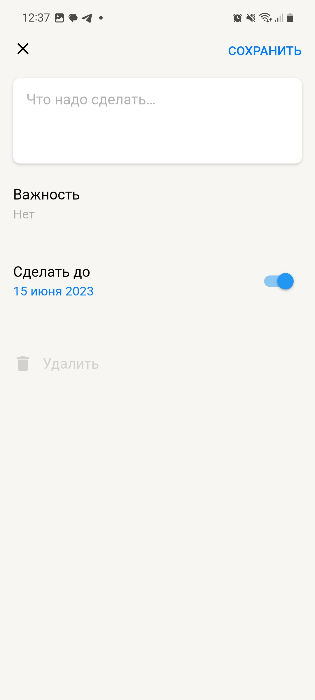

# TheForgetMeNotList

## Common 

The application contains:
- the main screen, as well as the screen for adding/editing tasks;
- swipe on the item Completed/Delete with logic;
- showing completed tasks with logic.

## APK

APK archive path: 
/apk-release.apk

## Getting Started

Run assets generation: 
flutter pub run build_runner build --delete-conflicting-outputs

